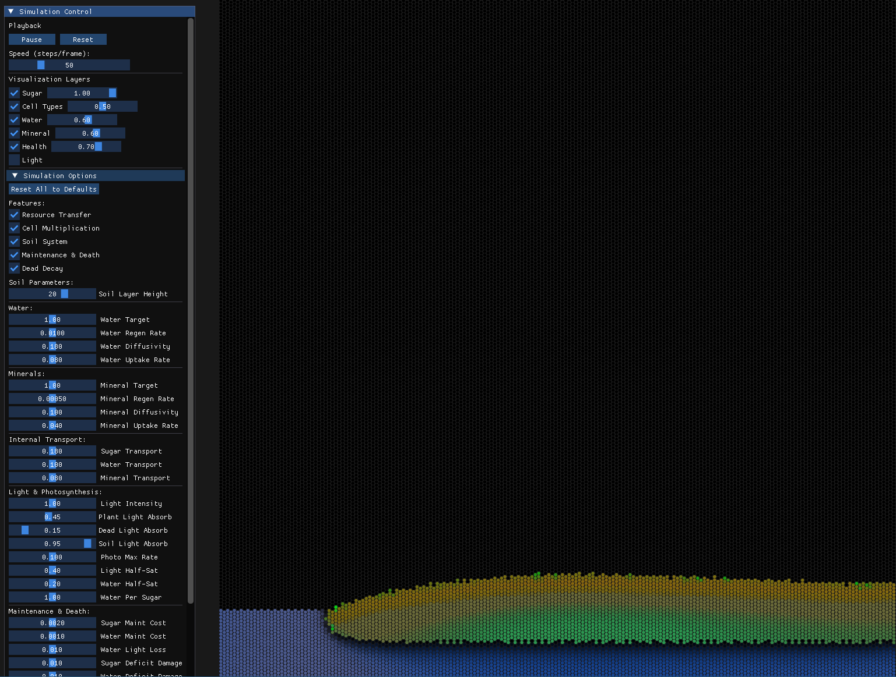

# plantsim

Plantsim is a plant growth simulator with one core constraint: plant shapes are never prescribed—they must **emerge** from environmental physics. Each cell follows purely local rules (absorb water, photosynthesize under light, pay maintenance, reproduce into empty neighbors), and the resulting global structure is a consequence of those pressures compounding, not of any hard-coded directional growth logic.

***This is a work in progress.*** The currently implemented stages of the simulation don't allow for real-plant-like shapes. Instead, the living organism appears as a blob covering the surface of the soil.



## How it works

The simulation runs on a hex grid. Each tick executes a pipeline of stages:

1. **Light** — top-down column walk; intensity attenuates through plant, dead, and soil cells
2. **Soil diffusion** — water and minerals regenerate toward targets and diffuse laterally through soil
3. **Soil absorption** — plant cells absorb resources from soil at the same tile
4. **Photosynthesis** — `sugar += f(light, water)` with Michaelis-Menten saturation; water is consumed as reagent
5. **Resource transfer** — sugar, water, and minerals diffuse through the connected plant network
6. **Maintenance & death** — cells pay sugar and water costs proportional to light (transpiration analog); health degrades on deficit, regenerates when fed; cells at health ≤ 0 die
7. **Dead decay** — dead matter slowly releases back into adjacent soil; empty dead tiles become air
8. **Reproduction** — eligible cells (enough sugar, empty neighbor exists) expand into a neighbor

## Architecture

```text
src/
  simulation/
    cpu/          # CPU backend
    cuda/         # GPU CUDA backend
  rendering/      # Real-time visualization of the simulation
docs/             # Design documents, notes, descriptions
```

## Tech stack

| Layer | Technology |
| --- | --- |
| Language | C++23 |
| Build | CMake |
| Compute (CPU) | Eigen (vectorization) |
| Compute (GPU) | CUDA |
| Rendering | OpenGL 4, GLFW |
| UI | ImGui |
| Testing | GTest |

## How to run

Build the main application:
```bash
mkdir build && cd build
cmake .. -DBUILD_MAIN=ON -DTARGET_BACKENDS=CPU
make -j$(nproc)
```

Start the main application window with the live visualization of the running simulation:
```bash
./bin/cpu/plantsim
```

### CMake options for build

| CMake option | Values | Default |
| --- | --- | --- |
| `TARGET_BACKENDS` | `CPU`, `CUDA`, `SYCL` (comma-separated) | `CPU` |
| `BUILD_MAIN` | `ON/OFF` | `ON` |
| `BUILD_TEST` | `ON/OFF` | `OFF` |
| `BUILD_BENCH` | `ON/OFF` | `OFF` |
| `ENABLE_PROFILING` | `ON/OFF` | `OFF` |


## Challenges

**1. Modeling plant biology at the right level of abstraction.** Plant structures can be approximated at many levels. At one extreme, explicit conditional rules that directly encode branching behavior, would be fast to implement, but it would prescribe the outcome rather than produce it. At the other extreme, molecular dynamics, gene expression, and intra-cell biochemistry is biologically faithful, but computationally intractable. The challenge is finding the level in between where environmental fields and local cell interactions are rich enough to produce realistic morphology, without hard-coding it.

**2. Finding parameters that allow realistic structures to emerge.** Even with the right mechanisms in place, the parameter space is large and the relationship between parameters and emergent shape is non-linear. Small changes to maintenance costs, resource diffusion rates, or reproduction thresholds can collapse the plant or prevent it from growing at all.
